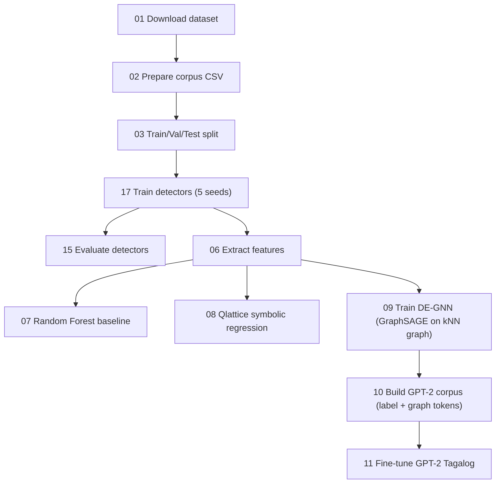
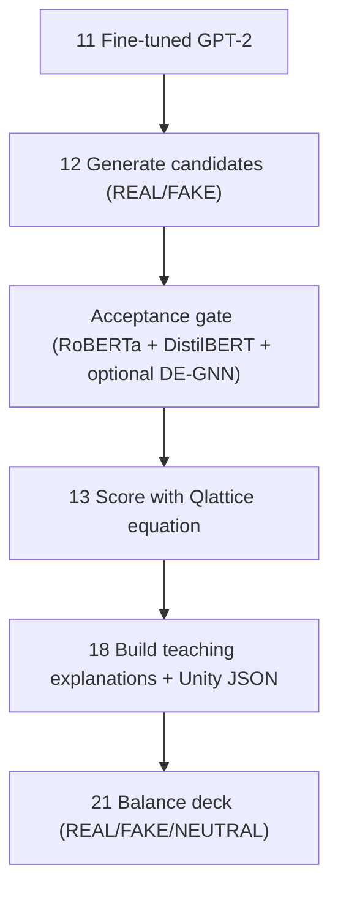

# MINERVA

**MINERVA** is an end-to-end **Software Engineering-oriented** pipeline that:
1) fine-tunes **Filipino/Tagalog fake-news detectors**,  
2) uses those detectors (plus **DE-GNN** + **Qlattice**) as **quality gates + explainers**, and  
3) produces **game-ready Unity “news cards”** (REAL / FAKE / NEUTRAL) with **human-readable teaching explanations**.

This repo is designed for a Philippine senior-high-school learning context: students are not just told a verdict-they are shown *why* a post looks credible vs suspicious, using signals that map to media-literacy cues.

> ⚠️ **Important:** MINERVA is an **educational content curation pipeline**, not a real-world fact-checking authority. The generator can still produce plausible but incorrect statements. Treat outputs as *simulated training material*.

---

## Key outputs

- **Detectors** (RoBERTa + DistilBERT) for REAL/FAKE classification
- **DE-GNN** (Dual-Embedding Graph Neural Network) confidence scores over a similarity graph
- **Qlattice equation** (symbolic regression) → interpretable scoring function
- **GPT-2 Tagalog generator** trained with **control tokens**
- **Unity card exports** (JSON) with:
  - `verdict` (real/fake/neutral)
  - `credibility_percent` for UI meters
  - `fake_likelihood_percent`
  - explanation fields for teachable feedback

---

## Repository layout

- `scripts/` : numbered pipeline scripts (01..21)
- `data/`    : `raw/`, `processed/`, `features/`, `gpt2/` (created at runtime)
- `models/`  : saved HF models + PCA + Qlattice equation + DE-GNN artifacts
- `logs/`    : training logs + evaluation summaries
- `generated/` : synthetic samples + Unity card JSON exports
- `docs/schemas/` : example JSON structures for scored records + Unity cards
- `reports/` : figures and thesis-aligned PDF reports
- `notebooks/` : Google Colab notebook(s)

---

## Pipeline at a glance

### Training + modeling



### Generation + curation for Unity



**Design principle:** treat generation as **untrusted** → only export samples that pass multiple independent checks.

---

## Quickstart (Google Colab)

Open and run (pick the one that exists in your repo):
- TBA

Why the “FIXED” notebook?
- Colab comes with preinstalled compiled packages; downgrading `numpy` without reinstalling `pandas` can cause binary incompatibilities. The fixed notebook handles clean installs and avoids the `numpy.dtype size changed` crash.

---

## Dependencies (`requirements.txt`)

The requirement set is intentionally **small** and grouped by purpose:

- **Core ML stack:** `torch`, `transformers`, `datasets`, `accelerate`
- **Tabular + classic ML:** `numpy`, `pandas`, `scikit-learn`, `joblib`
- **Explainability + reporting:** `captum`, `matplotlib`
- **Symbolic regression:** `feyn` (Qlattice engine)

Why not include “everything”?
- **Software engineering goal:** keep installs predictable, reduce dependency conflicts, and make the pipeline reproducible in Colab and local machines.

---

## Run the full pipeline (01 → 21)

From repo root:

```bash
python scripts/01_download_dataset.py
python scripts/02_prepare_dataset.py
python scripts/03_split_dataset.py

# Detectors: train 5 seeds and export best model to canonical paths
python scripts/17_run_5seeds_detectors.py --run_id RUN1

# Baselines + evaluation
python scripts/14_train_baseline_tfidf_logreg.py
python scripts/15_evaluate_detectors.py

# Feature engineering + interpretable/graph models
python scripts/06_extract_features.py
python scripts/07_train_random_forest.py
python scripts/08_train_qlattice.py
python scripts/09_train_degnn.py

# GPT-2 corpus + training (uses DE-GNN confidence tokens)
python scripts/10_prepare_gpt2MINERVA.py
python scripts/11_train_gpt2MINERVA.py

# Generate REAL + FAKE candidate cards, filtered by ensemble gate
python scripts/12_generate_gpt2MINERVA.py 500 fake 0.70 120 --accept_mode ensemble3 --out generated/gpt2_synthetic_samples_fake.jsonl
python scripts/12_generate_gpt2MINERVA.py 500 real 0.70 120 --accept_mode ensemble3 --out generated/gpt2_synthetic_samples_real.jsonl

# Score with Qlattice and keep only strong-margin samples
python scripts/13_score_generated_with_qlattice.py --in_jsonl generated/gpt2_synthetic_samples_fake.jsonl --target fake --out_scored generated/gpt2_synthetic_scored_fake.jsonl --out_final generated/gpt2_synthetic_final_fake.jsonl
python scripts/13_score_generated_with_qlattice.py --in_jsonl generated/gpt2_synthetic_samples_real.jsonl --target real --out_scored generated/gpt2_synthetic_scored_real.jsonl --out_final generated/gpt2_synthetic_final_real.jsonl

# (Optional) combine finals into one JSONL
cat generated/gpt2_synthetic_final_fake.jsonl generated/gpt2_synthetic_final_real.jsonl > generated/gpt2_synthetic_final_both.jsonl

# Build teaching explanations + Unity JSON
python scripts/18_verdict_explain.py --in_file generated/gpt2_synthetic_final_both.jsonl --out_file generated/unity_cards.json

# Create a 3-way band and EXACT balancing for game decks
python scripts/21_balance_unity_cards.py --in_file generated/unity_cards.json --out_file generated/unity_cards_balanced.json --n_per_class 200 --neutral_low 0.50 --neutral_high 0.60 --allow_reuse
```

---

## What each “main algorithm” contributes

This section is written for defense / panel questions: **WHY these parts exist** and **what problem each solves**.

### 1) Two Transformer detectors (RoBERTa Tagalog + DistilBERT multilingual)

**Used in:** scripts `17`, `04`, `05`, `06`, `12`, `15`

**Why two models instead of one?**
- **Philippine social media is code-switched** (Tagalog + English, “Taglish”), so we want:
  - a **Tagalog specialist** (captures Tagalog morphology/idioms better), and
  - a **multilingual generalist** (handles English fragments and mixed syntax).
- In engineering terms: two detectors act like **redundant sensors**. Disagreement = uncertainty → good for “NEUTRAL” cards and for rejecting questionable generations.

**How they’re used (not just as classifiers):**
- `06_extract_features.py` turns them into **feature generators**:
  - CLS embeddings → PCA features
  - calibrated probabilities (`p_roberta_fake`, `p_distil_fake`) → compact “credibility signals”
- `12_generate_gpt2MINERVA.py` uses detectors as an **accept/reject gate** to curate GPT outputs.

### 2) PCA over dual embedding spaces

**Used in:** `06_extract_features.py`

Transformers produce high-dimensional embeddings. PCA is used to:
- reduce dimensionality (faster downstream models, smaller artifacts)
- preserve the strongest variance directions
- make tabular models feasible (RF, Qlattice, DE-GNN)

### 3) Random Forest (tabular baseline)

**Used in:** `07_train_random_forest.py`

Why RF is still included:
- fast to train, strong baseline
- exposes feature importance (debugging + insight)
- helps verify whether the neural models are doing something meaningful

### 4) Qlattice symbolic regression (interpretable “equation”)

**Used in:** `08_train_qlattice.py`, `13_score_generated_with_qlattice.py`, `18_verdict_explain.py`

Why Qlattice:
- Produces a **small mathematical expression** (equation) instead of an opaque model.
- That equation can be:
  - versioned like code,
  - re-evaluated in Python deterministically,
  - explained to students using *human* heuristics (“high punctuation + certain embedding pattern increases fake-likelihood”).

In MINERVA, the Qlattice score becomes a **teaching-friendly** scalar signal:
- `p_qlattice_fake` → converted to `credibility_percent` UI meter
- `margin` from 0.5 → “difficulty” (easy/medium/hard)

### 5) DE-GNN (Dual-Embedding Graph Neural Network)

**Used in:** `09_train_degnn.py`, `10_prepare_gpt2MINERVA.py`, `12_generate_gpt2MINERVA.py`

**What “dual embedding” means here:**
- We fuse two semantic views of the same text:
  1) RoBERTa-PCA features
  2) DistilBERT-PCA features
- plus detector probabilities

**Why a GNN at all (if we already have embeddings)?**
- Real posts often form *clusters* by topic, wording style, and narrative patterns.
- A kNN similarity graph approximates that structure when we don’t have social-network edges.
- GraphSAGE aggregates neighborhood signals, which can smooth noisy predictions and yield a confidence measure.

**Why not just kNN?**
- Plain kNN is a *fixed rule* and scales poorly (store all points; sensitive to distance noise).
- GraphSAGE learns how to weigh self vs neighbor information and is designed for **inductive** settings (score new nodes by connecting them to the reference graph).

**How DE-GNN impacts GPT generation (the “before it feeds to GPT” part):**
1) `09_train_degnn.py` exports `p_degnn_fake` per training sample.
2) `10_prepare_gpt2MINERVA.py` converts that into `<|graph=high|>/<|graph=mid|>/<|graph=low|>` tokens.
3) GPT-2 is fine-tuned on text that includes both:
   - `<|label=fake|>` vs `<|label=real|>` (class conditioning)
   - `<|graph=...|>` (graph-confidence conditioning)

Result: we can ask GPT to generate “REAL + graph-high” vs “FAKE + graph-low”, and we can reject generations that fail the DE-GNN gate.

### 6) GPT-2 Tagalog generation + quality gates

**Used in:** `10`, `11`, `12`, `13`

Why generate at all?
- The Unity game needs *many* short, varied cards.
- Real labeled data is limited; generation helps build an educational deck while protecting the original dataset from direct reuse.

Why we don’t “trust” the generator:
- Generative models can hallucinate.

How MINERVA reduces risk:
- **conditioning tokens** (label + graph)
- **acceptance gating** using multiple detectors (`--accept_mode ensemble3`)
- **post-scoring** with a deterministic Qlattice equation

This is the core SE strategy: generation → **validation** → export.

---

## Unity integration

### Where the “scored” and “final” files come from

Per target class (REAL or FAKE):
- Script **12** writes:
  - `generated/gpt2_synthetic_samples_<target>.jsonl`  (accepted candidates)
- Script **13** writes:
  - `generated/gpt2_synthetic_scored_<target>.jsonl`   (adds Qlattice fields)
  - `generated/gpt2_synthetic_final_<target>.jsonl`    (filters by target + margin)

### Turning scores into teachable game content

- Script **18** turns final JSONL into Unity cards:
  - `credibility_percent` → credibility ring/meter
  - `verdict` → label/badge
  - `explanation.summary` → student-readable “why” text
  - `explanation.signals[]` → bullet list of cues (writing style, certainty, etc.)

- Script **21** creates a 3-way band (REAL/FAKE/NEUTRAL) and balances the deck:
  - default neutral band is **50-60% fake-likelihood** (your requested range)

---

## Why this is a Software Engineering study (not “just AI”)

The novelty here is primarily **systems integration**:

- **Modular pipeline** (01..21) with explicit artifacts and interfaces
- **Reproducibility**: multi-seed training, exported best detectors, deterministic scoring
- **Quality gates**: using independent models as acceptance tests for generated content
- **Explainability for end-users**: symbolic equation + structured explanations suitable for UI
- **Product integration**: balanced JSON decks for Unity Android deployment
- **Safety**: pseudonymization options to reduce leakage of real names

In other words: MINERVA is not “a model”; it’s a **maintainable ML-enabled product pipeline**.

---


### A) Detectors vs baseline

1) Train baseline:
```bash
python scripts/14_train_baseline_tfidf_logreg.py
```

2) Train detectors + evaluate:
```bash
python scripts/17_run_5seeds_detectors.py --run_id RUN1
python scripts/15_evaluate_detectors.py
```

Show: accuracy/F1 of baseline vs transformers.

### B) Ensembling as a quality gate

Run Script 12 with different `--accept_mode` and compare:
- acceptance rate (how many candidates were rejected)
- distribution of Qlattice scores after Script 13

Example:
```bash
python scripts/12_generate_gpt2MINERVA.py 300 fake 0.70 120 --accept_mode roberta
python scripts/12_generate_gpt2MINERVA.py 300 fake 0.70 120 --accept_mode distilbert
python scripts/12_generate_gpt2MINERVA.py 300 fake 0.70 120 --accept_mode ensemble
python scripts/12_generate_gpt2MINERVA.py 300 fake 0.70 120 --accept_mode ensemble3
```

### C) DE-GNN impact on the generator

1) Train GPT-2 corpus **with** and **without** graph tokens:
```bash
python scripts/10_prepare_gpt2MINERVA.py
python scripts/10_prepare_gpt2MINERVA.py --no_degnn_tokens --out_dir data/gpt2_no_graph
```

2) Fine-tune two GPT models and compare acceptance/scoring results.


### D) Qlattice margin as “teaching difficulty”

Show that increasing `--min_margin` yields:
- fewer but clearer cards
- more decisive “credibility” scores (farther from 50%)
- fewer ambiguous explanations

---

---

## Limitations 

- **Single dataset** (jcblaise/fake_news_filipino) → risk of domain shift.
- **Truth ≠ style**: detectors can learn stylistic cues, not factual reality.
- **Synthetic ≠ verified**: generated text is for education only.

Mitigations already in the pipeline:
- multi-model agreement gating
- margin-based filtering
- neutral band for uncertain items

---

## References (2020+)

> Links are provided for transparency and for defense citations.

- Transformers library & transformer fine-tuning practice:
  - Wolf et al., 2020. *Transformers: State-of-the-Art Natural Language Processing.* EMNLP Demos. https://aclanthology.org/2020.emnlp-demos.6/

- Graph neural networks (background + methods):
  - Zhou et al., 2020. *Graph neural networks: A review of methods and applications.* AI Open. https://www.sciencedirect.com/science/article/pii/S2666651021000012

- Qlattice / Feyn symbolic regression:
  - Broløs et al., 2021. *An Approach to Symbolic Regression Using Feyn.* arXiv:2104.05417. https://arxiv.org/abs/2104.05417

- Hallucination risk in generative models:
  - Huang et al., 2023. *A Survey on Hallucination in Large Language Models.* arXiv:2311.05232. https://arxiv.org/abs/2311.05232

- Game-based / inoculation interventions against misinformation:
  - Roozenbeek et al., 2022. *Psychological inoculation improves resilience against misinformation on social media.* Science Advances. https://www.science.org/doi/10.1126/sciadv.abo6254
  - Neylan et al., 2023. *How to inoculate against multimodal misinformation.* Scientific Reports. https://www.nature.com/articles/s41598-023-43885-2

- Philippine / Filipino student credibility and MIL context:
  - Fajardo, 2023. *Filipino students' competency in evaluating the credibility of digital media content.* Journal of Media Literacy Education. https://digitalcommons.uri.edu/jmle/vol15/iss2/7/
  - Bautista Jr., 2021. *Teaching Media and Information Literacy in Philippine Senior High Schools: Strategies Used and Challenges Faced by Selected Teachers.* Asian Journal on Perspectives in Education. https://ajpe.feu.edu.ph/index.php/ajpe/article/view/7649

- Code-switching relevance (Tagalog-English):
  - Herrera et al., 2022. *A Dataset for Investigating Tagalog-English Code-Switching.* LREC. https://aclanthology.org/2022.lrec-1.225/

- MLOps / pipeline engineering best practices:
  - Google Cloud, 2024. *MLOps: Continuous delivery and automation pipelines in machine learning.* https://docs.cloud.google.com/architecture/mlops-continuous-delivery-and-automation-pipelines-in-machine-learning

- Ensemble transformer rationale (example in fake-news tasks):
  - LekshmiAmmal et al., 2021. *Ensemble Transformer Model for Fake News Classification* (CLEF CheckThat! Lab). https://ceur-ws.org/Vol-2936/paper-49.pdf

---

## Layman explanation (for non-technical readers)

We built a “news-training card factory” for Filipino students:

1) We teach two AI readers to recognize writing patterns common in real vs fake posts.
2) We make those two AI readers check each other so the system is less easily fooled.
3) We also add a “similarity map” (graph model) so the system can see whether a new post looks like known patterns.
4) We then use an equation (Qlattice) to turn the AI signals into a score students can understand.
5) Finally, we generate many practice cards and keep only the ones that pass the checks.

The result is a balanced deck of REAL/FAKE/NEUTRAL cards that your Unity game can show, with explanations that help students learn *how to think*, not just what to answer.
