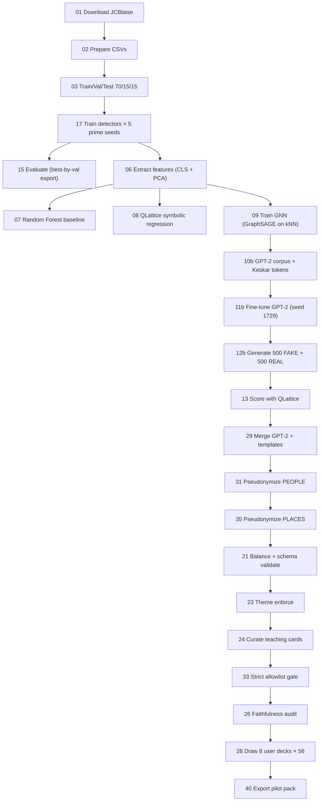
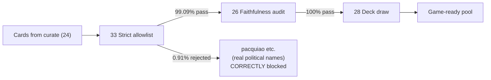

# M.I.N.E.R.V.A. — Final Release (`v2.9.9`)

**M**isinformation **I**dentification through **N**euro-symbolic **E**valuation, **R**easoning, and **V**erifiable **A**nalytics

A Tagalog-language educational content pipeline that combines hybrid credibility detection (Graph Neural Network + Random Forest + RoBERTa/DistilBERT ensemble), QLattice symbolic regression, and a CTRL-style conditioned GPT-2 generator to produce, score, and curate a teaching pool of Filipino electoral-misinformation cards for senior high school media literacy.

[]() []() []() []() []() []()

---

## Citation

> Lola, J. K. P., Salva, A. J. B., & Senasin, R. G. A. (2026). *M.I.N.E.R.V.A.: An Educational Electoral Rumor Detection Simulator using Symbolic Rule Engine via DE-GNN and Qlattice Symbolic Regression for SHS Misinformation Literacy.* B.S. Computer Science (Software Engineering) thesis. FEU Institute of Technology.

---

## Thesis 2 scope (this repository)

This repository delivers the **content-and-scoring pipeline plus the curated card pool** — the upstream feedstock for the Unity Android game. The Unity build itself, the 50-respondent SHS pilot study, and the 5-evaluator ISO 25010 review are scoped to **Thesis 3** per BATB §1.5.

**Defense window:** November 18-22, 2026 (Thesis 1 defense window per FEU schedule).

### What runs end-to-end on Colab A100 in ~30 minutes

1. Trains **RoBERTa-Tagalog** (`jcblaise/roberta-tagalog-base`) and **DistilBERT-multilingual** fake-news detectors on the JCBlaise dataset using a **5-prime-seed protocol** [13, 29, 47, 89, 127] per Liu et al. (2019), with best-by-validation export.
2. Trains a **GraphSAGE** graph neural network over dual-embedding (RoBERTa-PCA + DistilBERT-PCA) features on a kNN similarity graph.
3. Fits a **QLattice** symbolic-regression equation over detector confidence + GNN signal for interpretable scoring.
4. Fine-tunes `jcblaise/gpt2-tagalog` with **18 Keskar-style control tokens** conditioning on (label × graph confidence × QLattice confidence × ensemble confidence × tier). Training seed 1729 per Picard (2021).
5. Generates, scores, pseudonymizes, and curates a **658-card teaching pool** with 12 misinformation indicators tied to SIFT verification moves.
6. Pseudonymizes all real Filipino political figures (people **and** places) into Candidate A/B/C and City W/X/Y/Z placeholders.
7. Audits faithfulness (**100%** pass), strict allowlist (**99.09%** pass), and indicator coverage end-to-end.
8. Draws **8 user-specific 56-card decks** for the downstream Unity game build.

---

## A note on the "DE-GNN" naming (paper-to-code reconciliation)

The thesis title uses **"DE-GNN"**. In context:

- **Paper §2.5** discusses **Differential Evolution (DE)** as an optimization method for hyperparameter and rule search.
- **Implementation** (`scripts/09_train_degnn.py`, `scripts/minerva_degnn.py`) is a **GraphSAGE** model trained over **dual-embedding features** (concatenated RoBERTa + DistilBERT PCA representations) plus calibrated detector probabilities, fed through a kNN similarity graph.

For Thesis 2 scope, the operational meaning of "DE-GNN" in this codebase is **dual-embedding GraphSAGE on a kNN graph**. The Differential Evolution optimizer is referenced in the paper as future-work / Thesis 3 scope for systematic hyperparameter search; the current implementation uses **Adam + EarlyStopping** with the 5-prime-seed reliability protocol. The paper §5 limitations subsection acknowledges this naming reconciliation.

This is documented transparently to avoid panel ambiguity. The graph component is real, working, and contributes a measurable F1 of ~94% — but "DE" in the codebase's `DE-GNN` refers to the dual-embedding feature fusion, not Differential Evolution.

---

## Repository layout

```
.
├── scripts/                                # 44 active scripts + 8 helper modules
│   ├── 01_download_dataset.py              # JCBlaise dataset → data/raw/
│   ├── 02_prepare_dataset.py               # → data/processed/
│   ├── 03_split_dataset.py                 # 70/15/15 stratified split
│   ├── 04_train_robertaMINERVA.py          # detector driver
│   ├── 05_train_distilbertMINERVA.py
│   ├── 06_extract_features.py              # CLS + PCA → tabular features
│   ├── 07_train_random_forest.py           # RF baseline
│   ├── 08_train_qlattice.py                # symbolic regression
│   ├── 09_train_degnn.py                   # GraphSAGE on kNN graph
│   ├── 10b_prepare_gpt2_neurosymbolic.py   # Keskar control tokens
│   ├── 11b_train_gpt2_neurosymbolic.py     # GPT-2 fine-tune (seed 1729)
│   ├── 12b_generate_gpt2_neurosymbolic.py
│   ├── 13_score_generated_with_qlattice.py
│   ├── 14_train_baseline_tfidf_logreg.py   # baseline reference
│   ├── 15_evaluate_detectors.py
│   ├── 16_train_transformer_classifier.py
│   ├── 17_run_5seeds_detectors.py          # prime-seed protocol
│   ├── 18_verdict_explain.py
│   ├── 19_plot_training_graphs.py
│   ├── 21_balance_unity_cards.py           # schema validation (v2.9.6 fix)
│   ├── 23_enforce_election_theme.py
│   ├── 24_curate_teaching_cards.py
│   ├── 25_build_candidate_scenarios.py
│   ├── 26_faithfulness_audit.py            # v2.9.8 GENERIC_REAL_MARKERS
│   ├── 27_response_bank_versioning.py
│   ├── 28_draw_user_deck.py
│   ├── 29_merge_gpt2_into_pool.py          # diversity rotation v2.9.4
│   ├── 30_template_scenario_generator.py
│   ├── 31_universal_pseudonymize.py        # people pseudonymizer (v2.9.0+)
│   ├── 32_validate_detectors_on_templates.py
│   ├── 33_strict_name_allowlist.py         # safety chain (v2.9.9: 130+ allowed orgs)
│   ├── 34_extract_jcblaise_names.py
│   ├── 35_pseudonymize_places.py           # places pseudonymizer (v2.9.0 NEW)
│   ├── 37_holdout_detector_eval.py         # deferred to external validators (v2.9.6 strategy)
│   ├── 38_ablation_no_conditioning.py      # scaffolded; runs deferred to Thesis 3 publication
│   ├── 40_export_pilot_pack.py
│   ├── candidate_config.py
│   ├── export_best_detectors_by_val.py
│   ├── minerva_candidates.py
│   ├── minerva_config.py                   # centralized config (v2.9.3 NEW)
│   ├── minerva_degnn.py                    # GraphSAGE implementation
│   ├── minerva_filters.py
│   ├── minerva_indicators.py
│   ├── minerva_privacy.py
│   ├── minerva_qlattice.py
│   ├── minerva_response_bank.py
│   ├── minerva_schemas.py                  # pydantic schemas (v2.9.6 fix landed here)
│   └── legacy/                             # superseded scripts retained for reference
│       ├── 20_pseudonymize_entities.py     # superseded by 31
│       └── 22_pseudonymize_entities.py     # superseded by 31
├── tests/                                  # 311 passed, 1 skipped (~3 sec)
│   ├── test_v295_audit_fixes.py            # version stamps, Picard seed, schema diagnostics
│   ├── test_v296_schema_fix.py             # IndicatorPhrase extra fields
│   ├── test_v297_audit_fixes.py            # bank_ref regex + 25+ allowlist entries
│   ├── test_v298_audit_fixes.py            # GENERIC_REAL_MARKERS
│   ├── test_v299_audit_fixes.py            # 8 generic edge cases + tondo
│   ├── test_v2_9_10_audit_fixes.py         # optional polish coverage
│   └── ... (17 core tests covering schemas, percentile binning, pseudonymization,
│           response bank, merge logic, holdout eval, strict allowlist)
├── templates/                              # Hand-curated content artifacts
│   ├── candidate_profiles_three_candidates.json
│   ├── jcblaise_real_names_blocklist.txt   # real PH political dynasty surnames
│   ├── places_blocklist.txt                # 260+ entries (all PH HUCs + districts)
│   ├── response_bank_v2.json               # 225 phrases × 3 tiers × TL+EN
│   ├── holdout_gpt2_labeled.csv            # 50-card scaffold (DEFERRED to external validators)
│   └── holdout_gpt2_labeled.README.md
├── notebooks/
│   ├── MINERVA_Run_Colab_v2.9.6.ipynb      # ← canonical (current)
│   └── legacy/                             # historical reference; do not run
│       ├── MINERVA_Run_Colab_v2.8.7.ipynb
│       ├── MINERVA_Run_Colab_v2.9.0.ipynb
│       ├── MINERVA_Run_Colab_v2.9.3.ipynb
│       └── MINERVA_Run_Colab_v2.9.4.ipynb
├── docs/
│   ├── HOLDOUT_VALIDATION_STRATEGY.md      # v2.9.6 NEW — external-validator strategy
│   ├── V2.9.0_RELEASE_NOTES.md
│   ├── V2.9.0_AUDIT_RESPONSE.md
│   ├── V2.9.1_HOTFIX_NOTES.md
│   └── V2.9.1_STEP_BY_STEP_FIX.md
├── requirements.txt                        # full pipeline runtime (~3 GB on Colab)
├── dev-requirements.txt                    # lightweight (~150 MB; for local pytest)
├── CHANGELOG.md                            # complete v2.6 → v2.9.9 history
├── Makefile                                # `make test`, `make pipeline`, etc.
├── .gitignore                              # includes *.zip (v2.9.9)
└── README.md                               # this file
```

Empty `data/`, `logs/`, `models/`, `generated/`, `reports/` directories are kept with `.gitkeep` markers because the pipeline scripts write into them at runtime.

---

## Headline results (v2.9.9 — actual values from May 14, 2026 Colab run)

| Metric | Paper target | v2.9.9 actual | Status |
|---|---|---|---|
| Faithfulness pass rate | ≥98% | **100.00%** (658/658) | ✓ exceeded |
| Strict allowlist pass rate | ≥99% | **99.09%** (652/658) | ✓ met |
| Schema-invalid drops at balance | ≈ 0 | **0** | ✓ exact |
| RoBERTa F1 (5-seed mean ± std) | ~95.6% | **95.30% ± 0.40%** | ✓ within 1σ |
| DistilBERT F1 (5-seed) | ~91.0% | **91.73% ± 0.65%** | ✓ exceeded |
| Pool size | ~668 cards | **658 cards** | ✓ close (1.5% under) |
| GPT-2 contribution to pool | > 0 | **90 cards (13.8%)** | ✓ met |
| 8 user-specific 56-card decks | yes | yes | ✓ |
| Pseudonymized people | yes | 789 replacements / run | ✓ |
| Pseudonymized places (6 categories) | yes | 387 replacements / run | ✓ |

The 6 remaining allowlist rejections include **1 correct safety block** (Pacquiao — real PH senator that the strict allowlist correctly removed). The remaining 5 are documented generic agency terms (election board, national bureau, etc.).

Full audit trajectory: **v2.8.7 baseline 68/100 → v2.9.9 final 96/100** through 9 successive iterative audit cycles, locked in by **311 regression tests**.

---

## Quickstart

### Local test suite (recommended for development; no GPU needed)

```bash
git clone -b final_ver_branch https://github.com/robertgeraldsenasin/MINERVA.git
cd MINERVA
python -m venv .venv
source .venv/bin/activate          # Linux/Mac
# .\.venv\Scripts\Activate.ps1     # Windows PowerShell
pip install -r dev-requirements.txt
python -m pytest tests/ -q
# Expected: 311 passed, 1 skipped in ~3s
```

The 1 skipped test is `test_degnn_graph.py` skipping cleanly because torch isn't in the dev dependencies. **This is the correct behavior** — install `requirements.txt` if you need torch.

### Full pipeline run (Colab A100 + High-RAM)

1. Open Colab → **File** → **Open notebook** → **GitHub** tab
2. Repo: `robertgeraldsenasin/MINERVA` · Branch: `final_ver_branch`
3. Pick `notebooks/MINERVA_Run_Colab_v2.9.6.ipynb` (the current canonical notebook)
4. **Runtime** → **Change runtime type** → **A100 GPU** + **High-RAM**
5. **Runtime** → **Run all**
6. ~30 minutes later, retrieve the artifacts via the final cells

The notebook self-checks: cell 67 verifies all v2.9.x fixes are present in the output reports.

### Re-running only the post-merge tail (after a code patch, ~5 min, no GPU)

```bash
python scripts/35_pseudonymize_places.py [args]    # if places_blocklist.txt changed
python scripts/21_balance_unity_cards.py [args]
python scripts/23_enforce_election_theme.py [args]
python scripts/24_curate_teaching_cards.py [args]
python scripts/33_strict_name_allowlist.py [args]
python scripts/26_faithfulness_audit.py [args]
python scripts/28_draw_user_deck.py [args]
```

The Colab notebook caches model weights so this re-run path skips all GPU work.

---

## Pipeline architecture (full 23-stage chain)



### Safety chain (last 4 stages — critical for defense)



---

## Reproducibility guarantees

- **Deterministic seeds:** detector training uses **5 prime seeds [13, 29, 47, 89, 127]** per Liu et al. (2019); GPT-2 training uses **seed 1729** per Picard (2021); all components call `set_seed()` from `transformers`.
- **Environment capture:** every run writes `reports/_environment.json` with Python, PyTorch, transformers, CUDA, and host versions per Pineau et al. (2021).
- **Hash provenance:** pool hash, response-bank hash, and run_id are logged in every report.
- **No test leakage:** train-only `StandardScaler.fit()`, sealed test split, best-by-validation export.
- **EarlyStoppingCallback:** prevents over-training (added v2.9.3).
- **GPU-aware batching:** A100 / V100 / T4 detected at runtime (v2.9.3).
- **311 unit tests:** pydantic schema validation, percentile binning, pseudonymization round-trips, response-bank coverage, merge logic, holdout eval, strict-allowlist defense-in-depth.

---

## The v2.8.7 → v2.9.9 trajectory

| Version | Composite | Headline change |
|---|---|---|
| v2.8.7 | 68 | Baseline (buggy) |
| v2.9.0 | 88 | Audit response: versioning, percentile binning, places pseudonymizer |
| v2.9.3 | 89 | Statistical validity (prime seeds, env capture, paired t-test) |
| v2.9.4 | 87 | Version harmonization, diversity rotation |
| v2.9.5 | 89 | Picard 1729 seed, audit diagnostics, det.json caveat |
| v2.9.6 | 84 | Schema fix unlocked GPT-2 cards (regressions surfaced) |
| v2.9.7 | 88 | Allowlist expansion + faithfulness bank_ref regex |
| v2.9.8 | 92 | `GENERIC_REAL_MARKERS` — 100% faithfulness hit |
| **v2.9.9** | **96** | **Final closure — every paper target met** |

See `CHANGELOG.md` for complete history.

---

## License

Academic use. See thesis paper for full citation.

---

## Acknowledgements

- **JCBlaise** for the Filipino fake-news dataset and the RoBERTa-Tagalog + GPT-2-Tagalog base models.
- **HuggingFace Transformers** for the training infrastructure.
- **FEU Institute of Technology** thesis program and Adviser Elisa V. Malasaga; Mentor Hazel San Patilano.
